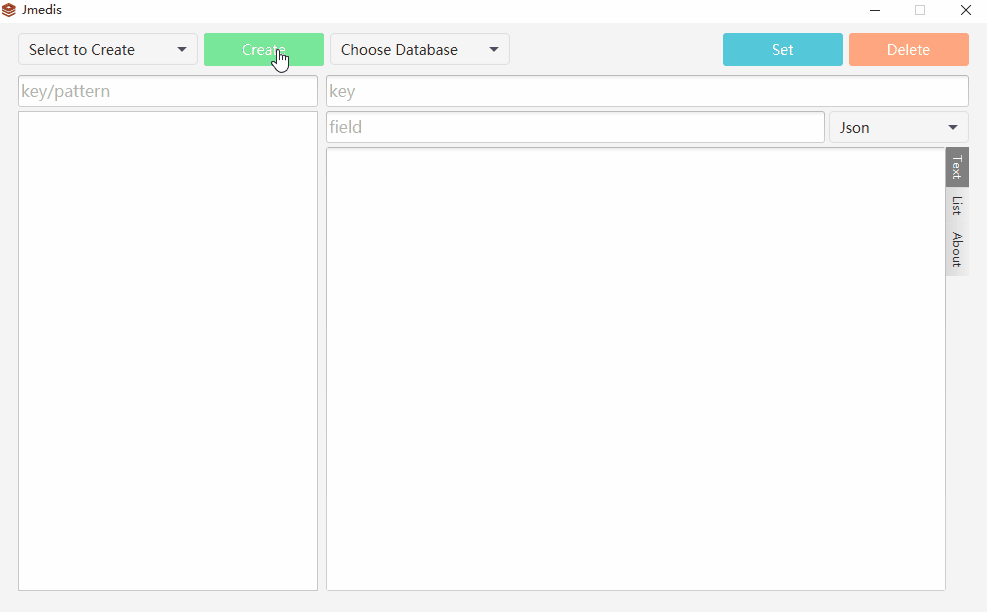

# jmedis

A crossplatform redis management tool written in kotlin + [tornadofx](https://github.com/edvin/tornadofx).

- Redis client is jedis-2.9.0.

- To run jmedis need java environment = JDK1.8.
Of course, you can also copy the jre directory of jdk8 to the same directory as jmedis.

## Run on Mac
You can package with mvn command:
`mvn clean package`
and run jar file.

## Run on Windows
Download [here](https://github.com/ysdxz207/jmedis/releases)

## Tutorial

## LICENCE
[MIT](https://github.com/ysdxz207/jmedis/blob/master/LICENSE)

